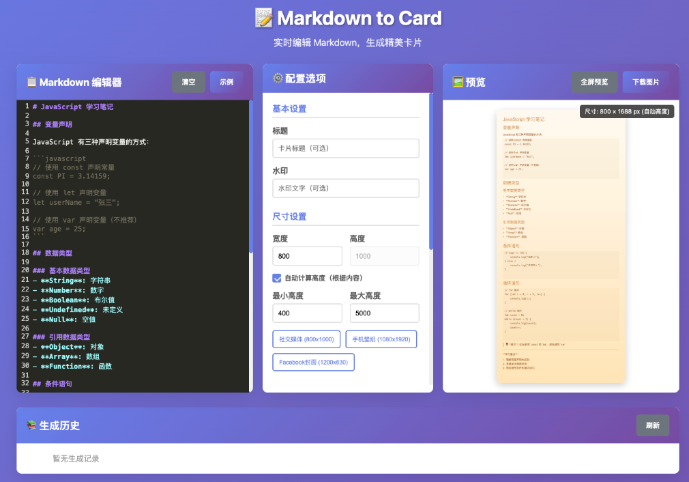

# Markdown to Card - MCP Tool

A powerful MCP tool for converting Markdown documents into beautiful knowledge card images, supporting multiple card styles, perfect for blogs and social media sharing.

[中文版本](README_zh.md) | [English Version](README.md)

<div align="center">
  
</div>

<br>

## Features

### 🎨 Multiple Card Styles
Support for 20+ beautiful card styles:
- Warm Soft - Perfect for life sharing
- Elegant Gray - Professional business style
- Dreamy Gradient - Creative design style
- Fresh Natural - Green eco-friendly theme
- Tech Blue - Dedicated for technical content
- Elegant Purple - Premium elegant style
- Vibrant Orange - Energetic design
- More styles...

### 📝 Complete Markdown Support
- ✅ Headers (H1-H6)
- ✅ Paragraphs and text styles
- ✅ Ordered and unordered lists
- ✅ Code blocks (with syntax highlighting)
- ✅ Quote blocks
- ✅ Tables
- ✅ Horizontal rules
- ✅ Math formulas (planned)
- ✅ Flowcharts and sequence diagrams (planned)

### 🚀 Multiple Usage Methods
- **MCP Server** - Integrate with Claude, Cursor, and other AI tools
- **API Service** - HTTP interface for integration with any application
- **Command Line Tool** - Direct terminal usage

## Quick Start

### 1. Install Dependencies

```bash
npm install
```

### 2. Build Project

```bash
npm run build
```

### 3. Run Service

#### Run as MCP Server
```bash
npm run dev -- --mcp
```

#### Run as API Server
```bash
npm run dev -- --api
```

## Usage

### MCP Server Mode

The MCP server provides the following tools:

#### 1. List All Available Styles
```typescript
// Tool name: list_styles
// Parameters: none
// Returns: List of all available styles
```

#### 2. Get Specific Style Details
```typescript
// Tool name: get_style
// Parameters: { styleId: string }
// Returns: Detailed configuration of the style
```

#### 3. Preview Card
```typescript
// Tool name: preview_card
// Parameters: {
//   markdown: string,
//   styleId: string,
//   width?: number,
//   height?: number,
//   title?: string,
//   watermark?: string
// }
// Returns: Base64 format image data
```

#### 4. Generate and Save Card
```typescript
// Tool name: generate_card
// Parameters: {
//   markdown: string,
//   styleId: string,
//   width?: number,
//   height?: number,
//   title?: string,
//   watermark?: string,
//   filename?: string
// }
// Returns: Information about the saved file
```

#### 5. List Generated Images
```typescript
// Tool name: list_generated_images
// Parameters: none
// Returns: List of all generated images
```

#### 6. Delete Image
```typescript
// Tool name: delete_image
// Parameters: { filename: string }
// Returns: Deletion result
```

### API Server Mode

The API server provides REST interfaces:

#### Get All Styles
```http
GET /api/styles
```

#### Get Specific Style
```http
GET /api/styles/:id
```

#### Preview Card
```http
POST /api/preview
Content-Type: application/json

{
  "markdown": "# Title\n\nThis is an example",
  "styleId": "warm-soft",
  "width": 800,
  "height": 1000,
  "title": "My Card",
  "watermark": "Created by MD-Card"
}
```

#### Generate Card
```http
POST /api/generate
Content-Type: application/json

{
  "markdown": "# Title\n\nThis is an example",
  "styleId": "warm-soft",
  "width": 800,
  "height": 1000,
  "title": "My Card",
  "watermark": "Created by MD-Card",
  "filename": "my-card"
}
```

#### Get Generated Image
```http
GET /api/images/:filename
```

#### List All Images
```http
GET /api/images
```

#### Delete Image
```http
DELETE /api/images/:filename
```

## Style Configuration

Each style contains the following configuration:

```typescript
interface CardStyle {
  name: string;           // Style name
  id: string;             // Style ID
  backgroundColor: string; // Background color
  textColor: string;      // Text color
  headerColor: string;    // Header color
  accentColor: string;    // Accent color
  borderRadius: number;   // Border radius
  padding: number;        // Padding
  fontFamily: string;     // Font family
  fontSize: number;       // Font size
  lineHeight: number;     // Line height
  gradient?: {            // Gradient background (optional)
    start: string;
    end: string;
    direction: 'horizontal' | 'vertical' | 'diagonal';
  };
  shadow?: {              // Shadow effect (optional)
    offsetX: number;
    offsetY: number;
    blur: number;
    color: string;
  };
}
```

## Integration with MCP Clients

### Configuration in Claude Desktop

Add the following to Claude Desktop's configuration file:

```json
{
  "mcpServers": {
    "markdown-to-card": {
      "command": "node",
      "args": ["path/to/mdtcard/dist/index.js", "--mcp"]
    }
  }
}
```

### Usage in Cursor

1. Install MCP extension
2. Configure server address
3. Start using card generation features

## Development

### Project Structure
```
src/
├── api/           # API server
├── styles/        # Card style definitions
├── types/         # TypeScript type definitions
├── utils/         # Utility functions
├── mcp-server.ts  # MCP server implementation
└── index.ts       # Main entry file
```

### Adding New Styles

1. Add new style in `src/styles/cardStyles.ts`
2. Ensure style ID is unique
3. Test style effects
4. Submit changes

### Extending Features

- Add new Markdown syntax support
- Implement more image format outputs
- Add animation effects
- Support custom fonts

## FAQ

### Q: How to customize styles?
A: Modify the `src/styles/cardStyles.ts` file to add new style configurations.

### Q: Which image formats are supported?
A: Currently supports PNG format, with plans to add JPEG, WebP, and other formats.

### Q: How to handle Chinese fonts?
A: Specify Chinese fonts in style configuration, such as "PingFang SC, Microsoft YaHei".

### Q: What if image generation is slow?
A: You can reduce image size or use simpler styles to improve generation speed.

## License

Apache License 2.0

## Contributing

Welcome to submit Issues and Pull Requests to improve this tool!

## Changelog

### v1.0.0
- Initial version release
- Support for 20+ card styles
- Complete Markdown syntax support
- Dual MCP and API mode support
- Real-time preview and image generation features